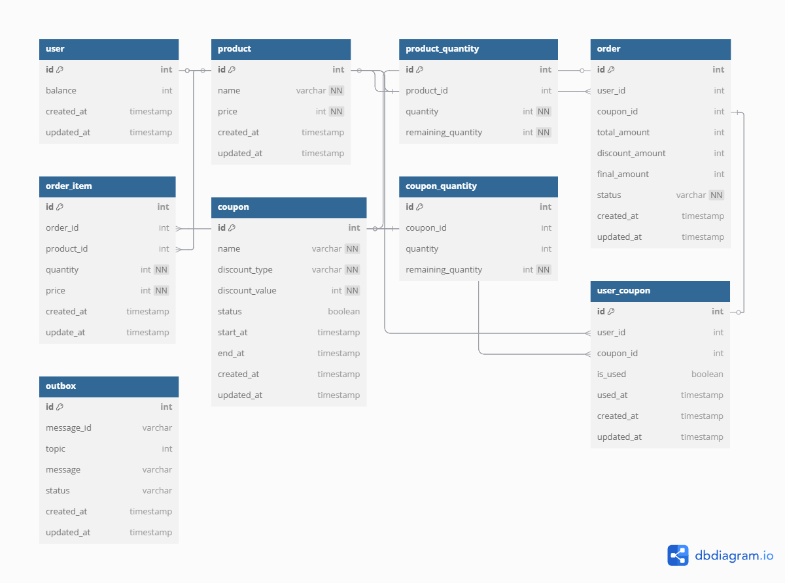

## 프로젝트 소개

---

e-commerce 시스템에 전반적인 기능 구현 및 다양한 기술을 적용한 학습 목적의 프로젝트입니다.

## 기술스택

`Typescript`, `Nestjs`, `MySQL`, `Prisma`, `Redis`, `Jest`, `Testcontainers`, `Docker`, `Kafka`, `k6`, `grafana`

---

## 목차

---

- [1. 요구사항](#1-요구사항)
- [2. UML을 통한 요구사항 분석](#2-uml을-통한-요구사항-분석)
- [3. Testcontainers와 통합 테스트 격리화](#3-testcontainers와-통합-테스트-격리화)
- [4. 동시성 제어와 통합테스트](#4-동시성-제어와-통합테스트)
- [5. 레디스 기반 캐싱전략](#5-레디스-기반-캐싱전략)
- [6. 이벤트와 트랜잭션 분리](#6-이벤트와-트랜잭션-분리)
- [7. 카프카 연결과 Transactional Outbox Pattern](#7-카프카-연결과-transactional-outbox-pattern)
- [8. 부하테스트](#8-부하테스트)
- [9. 패키지 구조](#9-패키지-구조)

## 1. 요구사항

---

**1️⃣ [주요] 잔액 충전 / 조회 API**

- 결제에 사용될 금액을 충전하는 API 를 작성합니다.
- 사용자 식별자 및 충전할 금액을 받아 잔액을 충전합니다.
- 사용자 식별자를 통해 해당 사용자의 잔액을 조회합니다.

**2️⃣ [기본] 상품 목록 조회 API**

- 상품 정보 ( ID, 이름, 가격, 잔여수량 ) 을 조회하는 API 를 작성합니다.
- 조회시점의 상품별 잔여수량이 정확하면 좋습니다.
- 페이지네이션 고려해주세요.

**3️⃣  [주요] 선착순 쿠폰 기능**

- 사용자는 선착순으로 할인 쿠폰을 발급받을 수 있습니다.
- 선착순 쿠폰 발급 API 및 보유 쿠폰 목록 조회 API 를 작성합니다.
- 주문 시에 유효한 할인 쿠폰을 함께 제출하면, 전체 주문금액에 대해 할인 혜택을 부여받을 수 있습니다.

**4️⃣ [주요] 주문 / 결제 API**

- 사용자 식별자와 (상품 ID, 수량) 목록을 입력받아 주문하고 결제를 수행하는 API 를 작성합니다.
- 결제는 기 충전된 잔액을 기반으로 수행하며 성공할 시 잔액을 차감해야 합니다.
- 데이터 분석을 위해 결제 성공 시에 실시간으로 주문 정보를 데이터 플랫폼에 전송해야 합니다.

**5️⃣  [기본] 상위 상품 조회 API**

- 최근 3일간 가장 많이 팔린 상위 5개 상품 정보를 제공하는 API 를 작성합니다.
- 통계 정보를 다루기 위한 기술적 고민을 충분히 해보도록 합니다.

## 2. UML을 통한 요구사항 분석

---

**[Flow Chart & Sequence Diagram](https://github.com/wooo73/e-commerce/blob/main/docs/uml.md)**

<strong>ERD</strong>

#### 

## 3. Testcontainers와 통합 테스트 격리화

---

#### 주요 내용

- 테스트 격리를 위한 Testcontainers 도입
- MySQL, Redis 컨테이너 기반 통합 테스트 환경 구축
- 테스트 데이터 초기화 및 환경 설정 자동화

**[테스트 컨테이너 문서](https://github.com/wooo73/e-commerce/blob/main/docs/testcontainsers.md)**

## 4. 동시성 제어와 통합테스트

---

#### 주요 내용

- 비즈니스 로직별 동시성 제어 전략 설계
- DB Lock과 분산락(Redis) 성능 비교 분석

**[동시성 제어 전략 설계](https://github.com/wooo73/e-commerce/blob/main/docs/lock-report.md)**

## 5. 레디스 기반 캐싱전략

---

#### 주요 내용

- 상품 조회 성능 개선을 위한 캐싱 전략 설계
- 캐시 스탬피드 현상 방지를 위한 해결책 구현

**[캐싱 전략](https://github.com/wooo73/e-commerce/blob/main/docs/cache.md)**

## 6. 이벤트와 트랜잭션 분리

---

- 이벤트를 활용한 트랜잭션 분리
- 결제 프로세스 외부 API 영향 제거

**[이벤트와 트랜잭션 분리](https://github.com/wooo73/e-commerce/blob/main/docs/event.md)**

## 7. 카프카 연결과 Transactional Outbox Pattern

---

#### 주요 내용

- Docker를 이용한 카프카 환경 구성 및 연동
- Transactional Outbox Pattern 구현
- 메시지 재발행 스케줄러 구현

**[카프카 연결과 Transactional Outbox Pattern](https://github.com/wooo73/e-commerce/blob/main/docs/kafka.md)**

## 8. 부하테스트

---

#### 주요 내용

- k6를 활용한 부하테스트 시나리오 구현
- 동시성 처리가 필요한 API 성능 측정
- 성능 개선 전후 Grafana + Influx DB를 활용한 메트릭 비교 분석

**[부하테스트 문서](https://github.com/wooo73/e-commerce/blob/feat/step19/docs/k6.md)**

## 9. 패키지 구조

---

... 작성 예정
