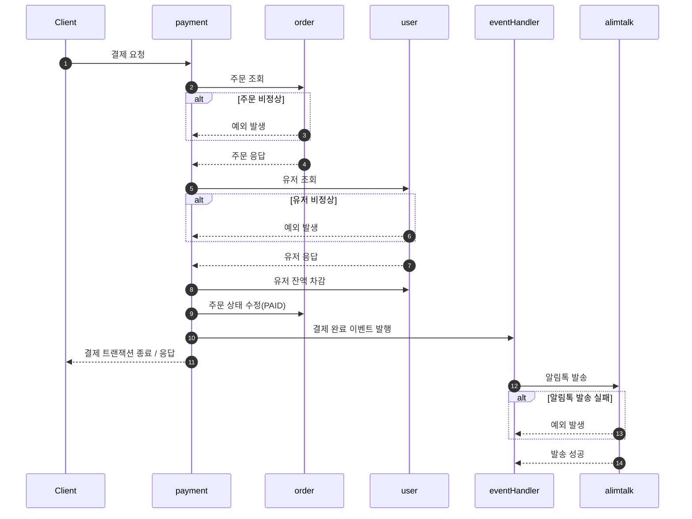

# 1. 이벤트 도입

---

**결제 로직**

```ts
async payment(dto: PaymentRequestDto) {
    const { orderId, userId } = dto;

    return await this.transactionManager.transaction(async (tx) => {
        //주문 조회
        const order = await this.orderService.getOrder(orderId, userId, tx);

        //유저 조회
        const user = await this.userService.getUserBalance(userId, tx);

        //결제 금액 차감
        await this.userService.useUserBalance(userId, user.balance, order.finalAmount, tx);

        //주문 상태 변경
        const updatedOrder = await this.orderService.payOrder(orderId, tx);

        //알림톡 발송(외부 API 요청)
        const sendAlimtalk = await this.alimtalkService.sendMessage(orderId);

        return updatedOrder;
    });
}
```

### 1.1 관련 이슈

- 외부 API 호출로 인한 긴 트랜잭션 시간(트랜잭션 타임아웃 위험)
- 외부 API 실패 시 전체 트랜잭션 롤백
- 외부 시스템과의 데이터 불일치 가능성
- 결제 로직과 알림 로직의 강한 결합

# 2. 이벤트 기반 아키텍처 도입

---

### 2.1 도입 목적

- 도메인 간 느슨한 결합 구현
- 비즈니스 로직과 부가 기능 분리
- 시스템 안정성 향상

# 3. 구현

---

```ts

//alimtalk handler
@EventsHandler(PaymentSuccessEvent)
export class AlimtalkHandler implements IEventHandler<PaymentSuccessEvent> {
    constructor(
        private readonly alimtalkService: AlimtalkService,
        private readonly loggerService: LoggerService,
    ) {}

    async handle(event: PaymentSuccessEvent) {
            const message = this.alimtalkService.setMessage(event);
            const result = await this.alimtalkService.sendMessage(message);
    }
}

//이벤트 구현체
import { IEvent } from '@nestjs/cqrs';

export type PaymentSuccessEventType = {
    id: number;
    userId: number;
    couponId: number | null;
    totalAmount: number;
    discountAmount: number;
    finalAmount: number;
    status: string;
    createdAt: Date;
    updatedAt: Date;
};

export class PaymentSuccessEvent implements IEvent {
    constructor(public readonly order: PaymentSuccessEventType) {}
}


//payment facade
async payment(dto: PaymentRequestDto) {
    const { orderId, userId } = dto;

    return await this.transactionManager.transaction(async (tx) => {
        ...

        //알림톡
        this.eventBus.publish(new PaymentSuccessEvent(updatedOrder));
        return updatedOrder;
    });
}
```

### 3.1 시퀀스 다이어그램



### 3.2 개선 사항

- 트랜잭션 분리를 통한 성능 향상
- 결제 프로세스 외부 API 영향 제거
- 시스템 확장성 개선
