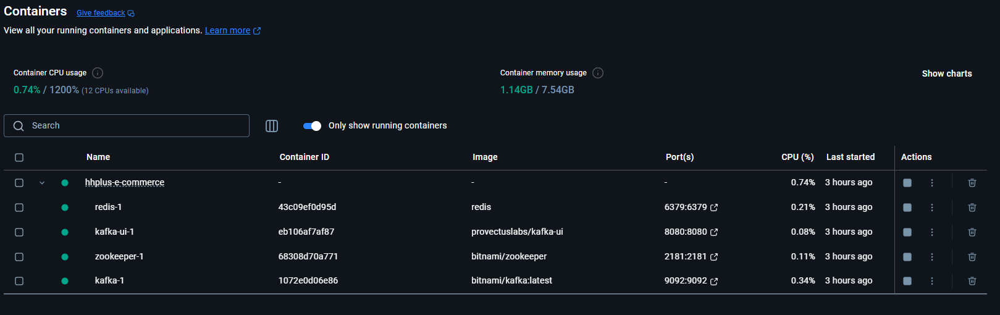
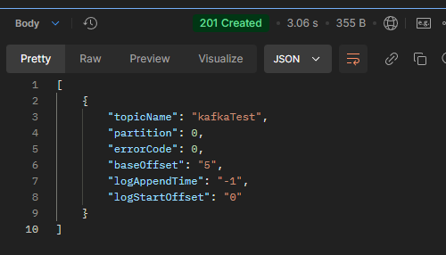
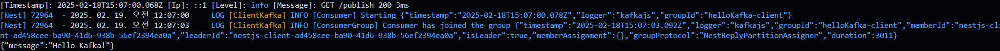
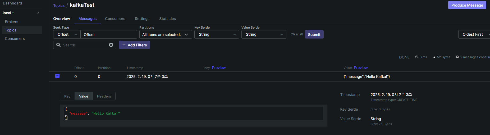
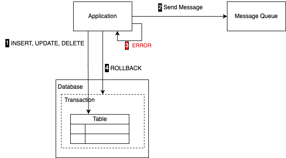
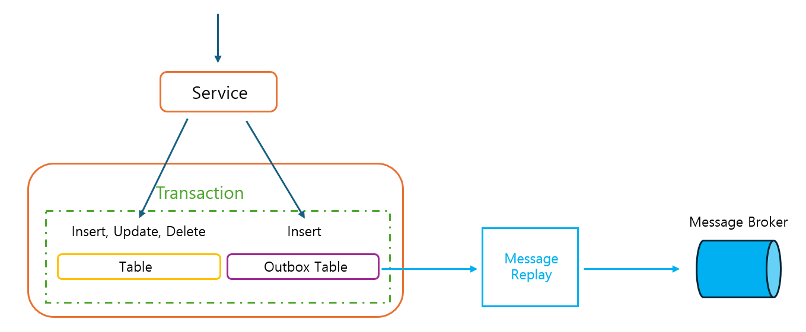
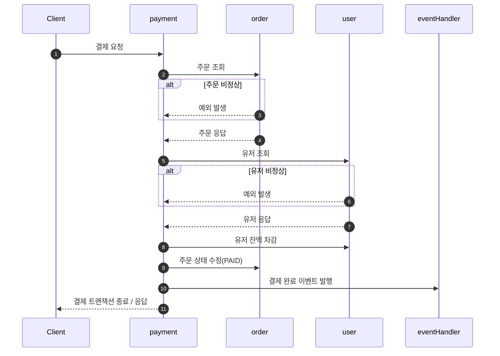
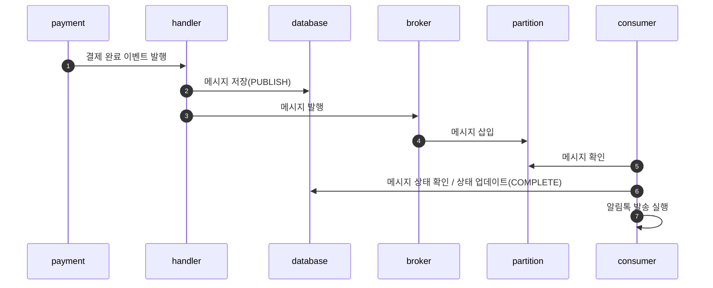
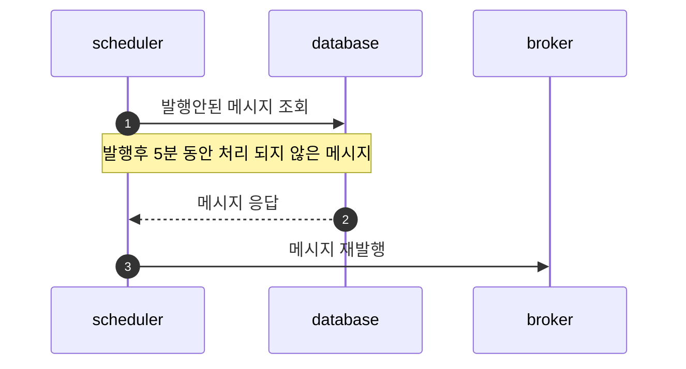

# 카프카 연결과 Transactional Outbox Pattern

---

## 목차

- [1. 카프카 연동](#1-카프카-연동)
- [2. Transactional Outbox Pattern](#2-transactional-outbox-pattern)

## 1. 카프카 연동

---

### 1.1 도커 세팅

```yaml
services:
    zookeeper:
        image: 'bitnami/zookeeper'
        ports:
            - '2181:2181'
        volumes:
            - 'zookeeper_data:/bitnami'
        environment:
            ALLOW_ANONYMOUS_LOGIN: yes
            ZOOKEEPER_CLIENT_PORT: 2181
            ZOOKEEPER_TICK_TIME: 3000

    kafka:
        image: 'bitnami/kafka:latest'
        ports:
            - '9092:9092'
        volumes:
            - 'kafka_data:/bitnami'
        depends_on:
            - zookeeper
        environment:
            KAFKA_CFG_ZOOKEEPER_CONNECT: zookeeper:2181
            KAFKA_CFG_LISTENER_SECURITY_PROTOCOL_MAP: PLAINTEXT:PLAINTEXT,PLAINTEXT_HOST:PLAINTEXT
            KAFKA_CFG_LISTENERS: PLAINTEXT://:29092,PLAINTEXT_HOST://:9092
            KAFKA_CFG_ADVERTISED_LISTENERS: PLAINTEXT://kafka:29092,PLAINTEXT_HOST://localhost:9092
            KAFKA_INTER_BROKER_LISTENER_NAME: PLAINTEXT

    kafka-ui:
        image: provectuslabs/kafka-ui
        ports:
            - '8080:8080'
        restart: always
        environment:
            KAFKA_CLUSTERS_0_NAME: local
            KAFKA_CLUSTERS_0_BOOTSTRAPSERVERS: kafka:29092
volumes:
    zookeeper_data:
        driver: local
    kafka_data:
        driver: local
```



### 1.2 카프카 라이브러리 설치

```bash
npm install @nestjs/microservices kafkajs
```

### 1.3 카프카 연결

**AppModule**

```typescript
import { ClientsModule, Transport } from '@nestjs/microservices';
import { AppController } from './app.controller';
import { AppService } from './app.service';

@Module({
    imports: [
        ClientsModule.register([
            {
                name: 'KAFKA_CLIENT',
                transport: Transport.KAFKA,
                options: {
                    client: {
                        clientId: 'nestjs',
                        brokers: ['localhost:9092'],
                    },
                    consumer: {
                        groupId: 'helloKafka',
                    },
                },
            },
        ]),
    ],
    controllers: [AppController],
    providers: [AppService],
})
export class AppModule {}
```

**AppController**

```typescript
import { Controller, Get, Inject } from '@nestjs/common';

import { AppService } from './app.service';
import { MessagePattern, Payload } from '@nestjs/microservices';

@Controller()
export class AppController {
    constructor(
        @Inject('KAFKA_CLIENT')
        private readonly appService: AppService,
    ) {}

    // 메시지 발행
    @Get('/publish')
    async publishTest() {
        this.appService.publishedMessage('Hello Kafka!');
    }

    // 메시지 수신
    @MessagePattern('kafkaTest')
    consumer(@Payload() payload) {
        return this.appService.printMessage(payload);
    }
}
```

**AppService**

```typescript
import { Inject, Injectable } from '@nestjs/common';
import { ClientKafka } from '@nestjs/microservices';

@Injectable()
export class AppService {
    constructor(
        @Inject('KAFKA_CLIENT')
        private readonly kafkaClient: ClientKafka,
    ) {}

    publishedMessage(message: string) {
        return this.kafkaClient.emit('kafkaTest', { message });
    }

    printMessage(payload) {
        console.log(JSON.stringify(payload));
        return payload;
    }
}
```

### 1.4 테스트 결과

- Publish 실행 확인
  

- Consumer 실행 확인
  

- Topic / Message 확인
  

## 2. Transactional Outbox Pattern

---

### 2.1 이벤트 발행의 보장

**원자적인 처리가 완료된 후 이벤트 발행이 실패하게 된다면 아래와 같은 문제가 발생한다.**

- 데이터는 저장이 됐지만 후속 비즈니스의 수행이 불가능한 상태로 유지되어 전체 비즈니스 수행에 실패로 이어지며 데이터 정합성 문제가 발생할 수 있다.
- 후속 비즈니스 오류 발생시 메시지 회수가 불가하다.



1. 비즈니스 로직 수행 후 메시지 큐에 메시지를 보낸다.
2. 트랜잭션 내에서 수행한 후속 비즈니스 로직에서 오류 발생.
3. 데이터베이스 롤백 수행.

그러나 메시지 큐에 보낸 메시지를 회수할 수는없다.

이를 방지 하기 위해 Transactional Messaging 기법을 활용하여 트랜잭션과 메시지를 원자적으로 수행하도록 한다.

### 2.2 Transactional Messaging

**"메시지를 데이터베이스 트랜잭션의 일부로 발행하는 것"을 의미한다.**

> 애플리케이션 비즈니스 로직에 의해 데이터베이스를 수정하는 작업과 메시지 큐에 메시지를 발행하는 작업, 두 가지 작업을 원자적으로 수행하여 데이터 일관성을 보장하는 것이다.

### 2.3 Transactional Outbox Pattern

**Transactional Outbox Pattern은 Transactional Messaging 의 대표적인 패턴이다.**



- 도메인 로직이 성공적으로 수행되었다면, 이에 해당하는 이벤트 메세지를 `Outbox Table` 이라는 별도의 테이블에 저장하여 함께 Commit
- 동일한 트랜잭션 내에서 이벤트 발행을 위한 Outbox 데이터 적재까지 진행해 이벤트 발행에 대해 보장
- 이벤트 발행 상태 또한 Outbox 데이터에 존재하므로, 배치 프로세스 등을 이용해 미발행된 데이터에 대한 Fallback 처리가 용이

### 2.4 구현

**이벤트 핸들러**

```ts
@EventsHandler(PaymentSuccessEvent)
export class PaymentHandler implements IEventHandler<PaymentSuccessEvent> {
    constructor(
        private readonly loggerService: LoggerService,
        private outboxService: OutboxService,
        @Inject('KAFKA_CLIENT')
        private readonly kafkaClient: ClientKafka,
    ) {}

    async handle(event: PaymentSuccessEvent) {
            //아웃 박스 데이터 생성(PUBLISH)
            await this.outboxService.createOutbox(event.payload);

            //카프카 메세지 발행
            this.kafkaClient.emit(KafkaTopic.PAYMENT_SUCCESS, JSON.stringify(event));
        }
    }
}
```

**컨슈머**

```ts
@Controller('paymentConsumer')
export class PaymentConsumer {
    constructor(
        private readonly loggerService: LoggerService,
        private readonly alimTalkService: AlimTalkService,
        private outboxService: OutboxService,
    ) {}

    @MessagePattern(KafkaTopic.PAYMENT_SUCCESS)
    async sendAlimTalk(message: PaymentSuccessEvent) {
        let messageId: string;
        try {
            const { payload } = message;

            // 아웃 박스 메세지 데이터 상태 확인 status === PUBLISH
            const outbox = await this.outboxService.getOutbox(
                payload.messageId,
                KafkaOutboxStatus.PUBLISH,
            );
            messageId = outbox.messageId;

            if (outbox) {
                // 아웃 박스 메세지 데이터 업데이트 = COMPLETE
                await this.outboxService.updateOutbox(messageId, KafkaOutboxStatus.COMPLETE);

                this.loggerService.debug('알림톡 발송 시작');
                await this.alimTalkService.sendMessage(JSON.parse(payload.message));
                this.loggerService.debug('알림톡 발송 완료');
            }
        } catch (err) {
            await this.outboxService.updateOutbox(messageId, KafkaOutboxStatus.PUBLISH);
            this.loggerService.error(err);
        }
    }
}
```

**메시지 재발행 스케줄러**

```ts
@Injectable()
export class OutboxScheduler {
    private static readonly retry = 'retry-uncommit-schedule';

    constructor(private readonly outboxService: OutboxService) {}

    @Cron(CronExpression.EVERY_5_MINUTES, {
        name: OutboxScheduler.retry,
    })
    async retryOutboxScheduler() {
        await this.outboxService.retryUncompletedOutbox();
    }
}
```

**메시지 재발행 로직**

```ts
async retryUncompletedOutbox() {
        const uncommitOutboxList = await this.outboxRepository.findUncommitOutbox();

        const standardTime = getPastMinuteDate(5).set('second', 0);

        const retryList = uncommitOutboxList.filter((outbox) => {
            const createdAt = convertDayjs(outbox.createdAt).set('second', 0);
            return createdAt.isBefore(standardTime);
        });

        Promise.allSettled(
            retryList.map((outbox) => {
                const payload = {
                    messageId: outbox.messageId,
                    topic: outbox.topic,
                    message: outbox.message,
                    status: outbox.status,
                };
                this.kafkaService.publish(outbox.topic, payload);
            }),
        );
    }
```

### 2.5 시퀀스 다이어그램

**결제**



**카프카**



**재발행 스케줄러**


