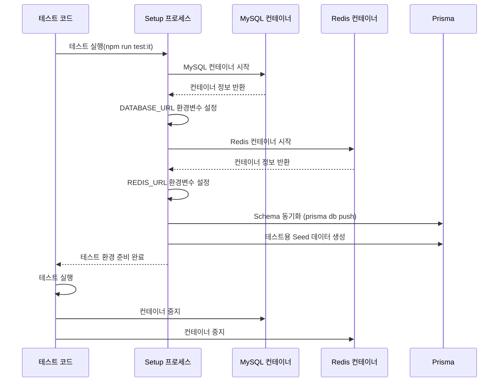

# Testcontainers

---

**테스트 코드 격리의 필요성**

- 테스트 코드가 데이터베이스와 결합되어있을 때 발생하는 문제들

1. 환경 의존성 문제

    - 테스트 실행 환경에서 DB가 실행 중이어야 한다.
    - 개발자마다 다른 로컬 DB 환경으로 인한 불일치 발생

2. 데이터 격리 문제
    - 이전 테스트의 잔여 데이터로 인한 예측 불가능한 결과

> 이를 방지하기 위해 각 테스트는 독립된 데이터베이스 환경에서 실행되어야 하며, 매 테스트마다 데이터베이스는 일관된 초기 상태를 가져야 합니다.

**Testcontainers**

`Docker 컨테이너 환경에 일회성 인스턴스를 제공하기 위한 오픈 소스 라이브러리.`

- 테스트 실행 환경에 구애받지 않는 독립적인 테스트 수행
- 매 테스트마다 동일한 초기 상태 보장
- 실제 운영 환경과 유사한 통합 테스트 환경 제공
- Docker 기반으로 다양한 버전의 서비스 테스트 용이

#### Setup

---

**컨테이너 세팅**

```ts
//init.ts
import { MySqlContainer } from '@testcontainers/mysql';
import { RedisContainer } from '@testcontainers/redis';

const init = async () => {
    await Promise.all([initMysql(), initRedis()]);
};

const initMysql = async () => {
    // 컨테이너 세팅
    const mysql = await new MySqlContainer('mysql:8')
        .withDatabase('testDB')
        .withUser('root')
        .withRootPassword('test1234')
        .start();

    // global 변수 등록
    global.mysql = mysql;

    // 컨테이너 정보 env 저장
    process.env.DATABASE_URL = `mysql://${mysql.getUsername()}:${mysql.getUserPassword()}@${mysql.getHost()}:${mysql.getPort()}/${mysql.getDatabase()}`;

    // schema.prisma 기반으로 테이블 생성
    execSync('npx prisma db push --force-reset', {
        stdio: 'inherit',
        env: { ...process.env },
    });

    // seed 데이터 생성
    execSync('npm run seed:test', {
        stdio: 'inherit',
        env: { ...process.env },
    });
};

const initRedis = async () => {
    const redis = await new RedisContainer('redis:7.0').withExposedPorts(6379).start();

    process.env.REDIS_URL = `redis://localhost:${redis.getMappedPort(6379)}`;

    global.redis = redis;
};

// down.ts
const down = async () => {
    await global.mysql.stop();
    await global.redis.stop();
};
```

#### 통합 테스트 스크립트 작성

---

**it.jest.json 작성**

```json
{
    "moduleFileExtensions": ["js", "json", "ts"],
    "rootDir": "../..",
    "testEnvironment": "node",
    "testRegex": ".it.spec.ts$",
    "transform": {
        "^.+\\.(t|j)s$": "ts-jest"
    },
    "globalSetup": "./test/it/setup.ts",
    "globalTeardown": "./test/it/down.ts"
}
```

**package.json 스크립트 작성**
`"test:it": "jest --config ./test/it/it.jest.json",`

#### 프로세스

---


